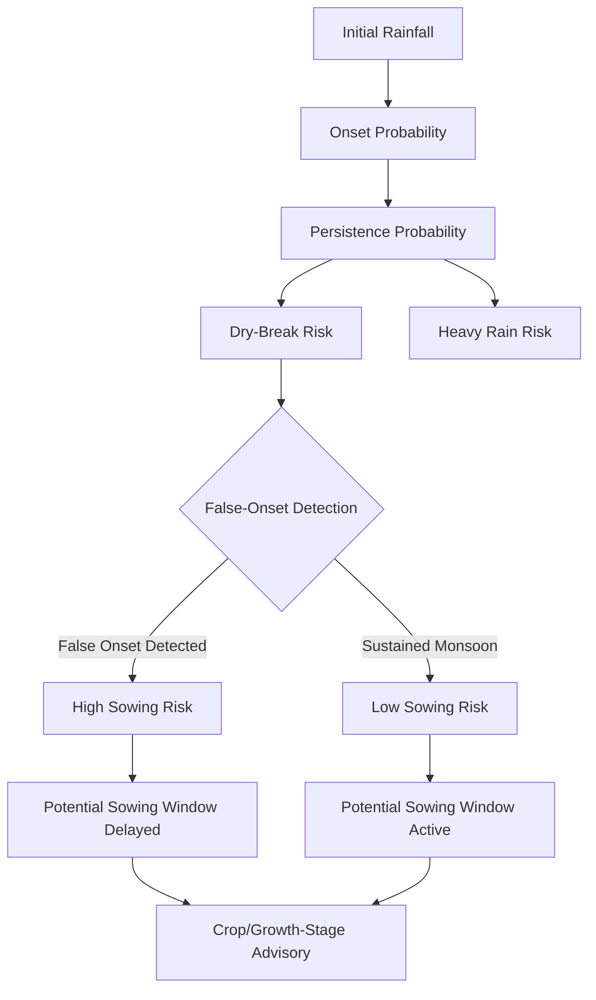

# Project & Problem Overview

## Project Overview
MonsoonGuard is an agricultural decision-support prototype designed for the SIH 2026. The system evaluates hyperlocal rainfall, calculates monsoon persistence probabilities, and flags high-risk periods where crop establishment could fail due to false onsets and subsequent dry-breaks.

## Problem Statement
Farmers face significant risks when deciding exactly when to sow seeds. The core agricultural decision problem is that **initial rainfall does not necessarily indicate a sustained monsoon**. 

A "false onset" occurs when initial rains are followed by a prolonged dry spell (a "dry-break"). If a farmer sows seeds immediately after a false onset, the seeds may germinate but then suffer high mortality due to lack of subsequent moisture. The core question MonsoonGuard answers is: **"Is it safe to sow?"**

## Core Concepts
*   **Onset Probability:** The likelihood that current rainfall represents the start of the monsoon season.
*   **Persistence Probability:** The likelihood that rainfall will continue consistently after the initial onset.
*   **Dry-Break Risk:** The probability of experiencing a prolonged dry spell (e.g., 7-day or 14-day) immediately following the initial rainfall.
*   **False Onset:** An event where initial rain is followed by a dry-break, creating a trap for early sowing.

## Target Users
1.  **Farmers:** Seeking direct, actionable insights on the safest potential sowing window.
2.  **Extension Officers / Agricultural Officials:** Monitoring block-level and district-level risks to proactively dispatch advisories and mitigate agricultural losses.

## Project Objectives & Scope
The objective is to provide a probabilistic risk-assessment tool that shifts the focus from simple weather forecasting to agricultural impact forecasting.

**Key Capabilities:**
*   **Hyperlocal Risk Assessment:** Evaluating risk at the village/block level.
*   **Decision Support Engine:** Translating weather probabilities into an actionable "Potential Sowing Window".
*   **Multilingual Support:** English, Gujarati, and Hindi localization.
*   **Dual Dashboards:** Specialized views for both Farmers and Extension Officers.

## Alignment with SIH Proposal
MonsoonGuard directly addresses the SIH proposal's demand for a system that prevents crop losses due to erratic monsoon behavior. The current system accurately reflects the proposed deterministic evaluation flow while paving the way for advanced ML integration. 

## Current Implementation Status
*   **Implemented Prototype Capabilities:** React frontend, dual dashboards, multilingual support, FastAPI backend, deterministic rules-based risk engine, synthetic ML smoke-tests, PostgreSQL integration, and a dedicated Demo Mode.
*   **Production Requirements:** Integration of live meteorological data, training on historical labeled datasets, and actual probability calibration.
*   **Future Capabilities:** Expansion to more states/crops, SMS-based advisory dispatch, and satellite imagery integration.

## Core Evaluation Workflow

