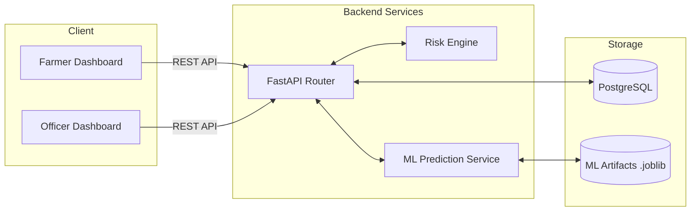
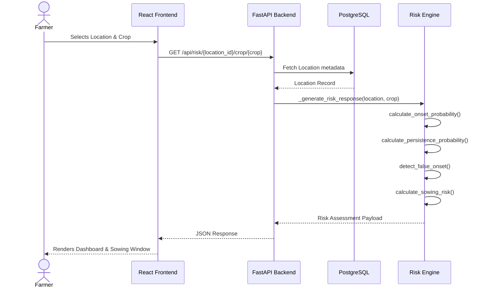
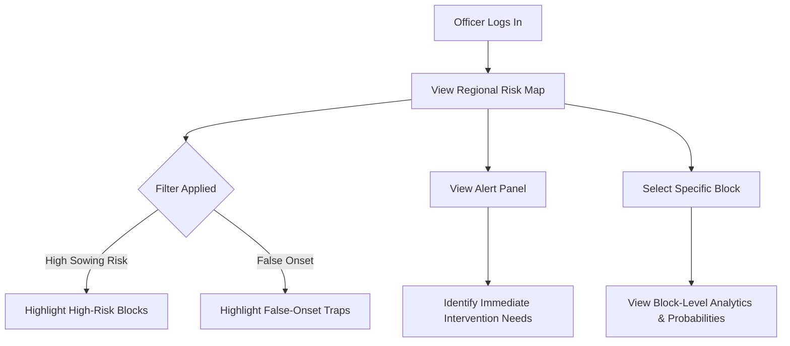
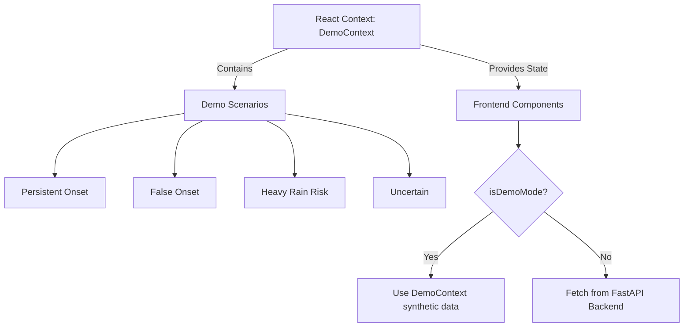
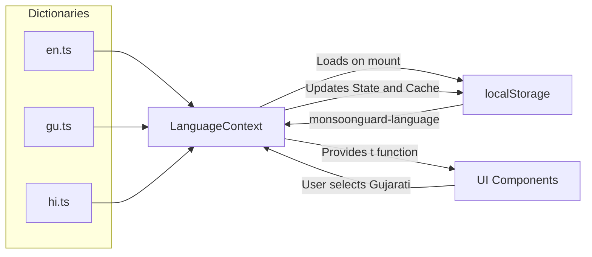
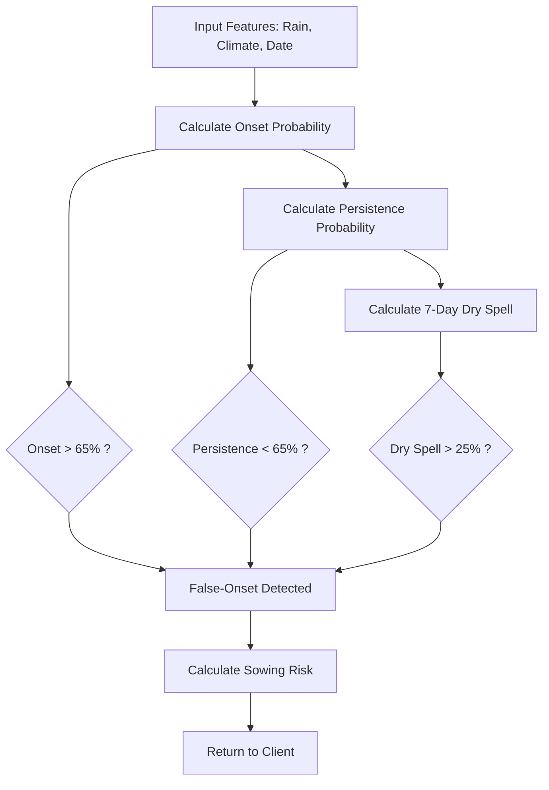

# Solution & System Architecture

## Overall Solution Architecture
MonsoonGuard uses a modern, decoupled architecture. The frontend is a React application built with Vite and TypeScript, styled with Tailwind CSS. It communicates via REST APIs to a Python FastAPI backend. The backend orchestrates data retrieval, invokes either a deterministic Risk Engine or an ML Prediction Service (depending on the configuration), and stores structural data in PostgreSQL.

### Technology Stack
*   **Frontend:** React, Vite, TypeScript, Tailwind CSS, Recharts, Lucide React
*   **Backend:** Python, FastAPI, Pydantic, SQLAlchemy
*   **Database:** PostgreSQL
*   **Machine Learning:** Scikit-Learn, XGBoost, Joblib
*   **Infrastructure:** Docker, Docker Compose

### Repository Structure
*   `frontend/` - React SPA containing Farmer and Officer dashboards.
*   `backend/` - FastAPI application containing API routes, models, and the risk engine.
*   `ml/` - ML pipeline scripts for feature engineering, training, and calibration.
*   `docs/` - Project documentation.

---

## 1. High-Level Architecture

## 2. Farmer Request/Response Sequence

## 3. Officer Dashboard Flow

## 4. Demo Mode Architecture
Because the prototype must function reliably in presentation environments without live telemetry, a sophisticated Demo Mode is implemented on the frontend.

## 5. Multilingual Architecture
The frontend utilizes a lightweight, custom React Context provider to handle translations dynamically without page reloads.

## 6. Core Risk-Processing Flow
False-onset detection and risk processing are strictly centralized within the backend. The frontend is a purely presentational layer.

