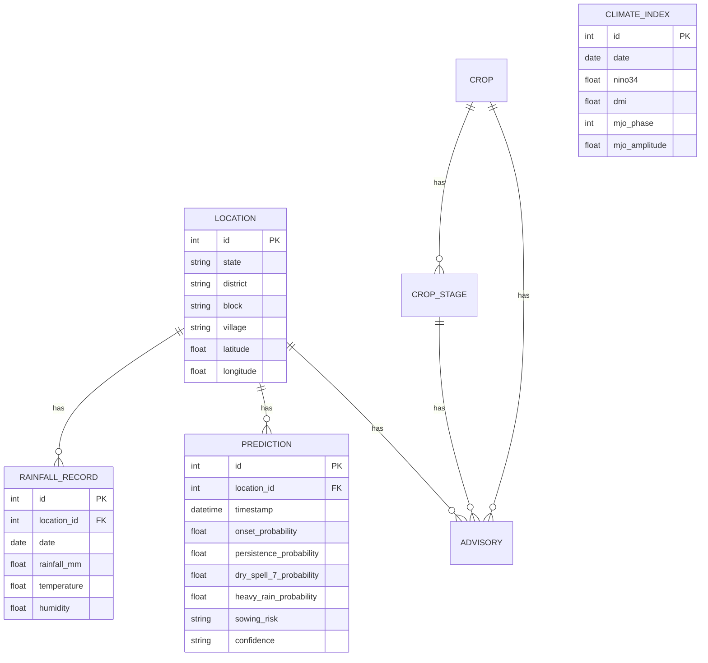
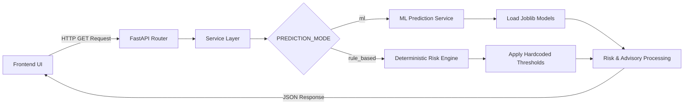

# Technical Implementation

## Frontend Architecture
The frontend is built as a Single Page Application (SPA) using React, Vite, and TypeScript.
*   **Routing:** Handled via `react-router-dom`, isolating the `/farmer` and `/officer` views.
*   **State Management:** Lightweight state management utilizing React Context (`DemoContext` for data injection, `LanguageContext` for i18n localization).
*   **API Service:** A centralized API service layer configured via environment variables to toggle between mock mode and the live backend.
*   **Localization:** A custom lightweight localization engine dynamically swaps JSON dictionary keys (`en.ts`, `gu.ts`, `hi.ts`) based on user selection, persisting choice via `localStorage`.

## Backend Architecture
The backend is a high-performance Python FastAPI application that serves the frontend and orchestrates the risk engine.
*   **FastAPI Routes:** Modularized via APIRouter into logical components (`risk.py`, `locations.py`, `map.py`, `advisory.py`).
*   **Schemas:** Data validation and serialization handled natively by Pydantic.
*   **Database:** PostgreSQL, interfaced using SQLAlchemy ORM.
*   **Risk Engine:** A dedicated module (`app/rules/risk_engine.py`) containing the deterministic logic for risk evaluation.

**Critical Architectural Constraint:**
The frontend does *not* independently calculate risk. All logic pertaining to "False Onset", "Dry-Break Risk", "Sowing Risk", and "Persistence" is strictly centralized in the backend `risk_engine.py` to ensure a single source of truth. The frontend purely renders the resulting JSON payload.

---

## Route & API Tables

### Important File Modules
| Module | Path | Purpose |
| :--- | :--- | :--- |
| **Risk Engine** | `backend/app/rules/risk_engine.py` | Single source of truth for all probabilistic risk and false-onset logic. |
| **ML Service** | `backend/app/services/ml_prediction_service.py` | Connects XGBoost/Joblib artifacts to the API router. |
| **DemoContext** | `frontend/src/context/DemoContext.tsx` | Injects synthetic frontend scenarios when backend is unavailable. |
| **LanguageContext** | `frontend/src/i18n/LanguageContext.tsx` | Provides the global `t()` translation function. |
| **DB Models** | `backend/app/database/models.py` | SQLAlchemy ORM definitions mapping to PostgreSQL tables. |

### API Endpoint Table
| Method | Endpoint | Description |
| :--- | :--- | :--- |
| `GET` | `/api/health` | Service health check. |
| `GET` | `/api/locations` | Retrieve all supported locations. |
| `GET` | `/api/risk/{location_id}` | Generate default risk assessment for a location. |
| `GET` | `/api/risk/{location_id}/crop/{crop}` | Generate crop-specific risk assessment. |
| `GET` | `/api/map/regional-risk` | Retrieve geospatial risk payload for Officer Dashboard. |
| `GET` | `/api/advisory/{location_id}/{crop}/{stage}` | Retrieve targeted agricultural advisory. |

---

## Database Overview
The PostgreSQL database persists geographical metadata, synthetic historical rainfall, climate indices, and system configurations. 

## System Integration Flow

