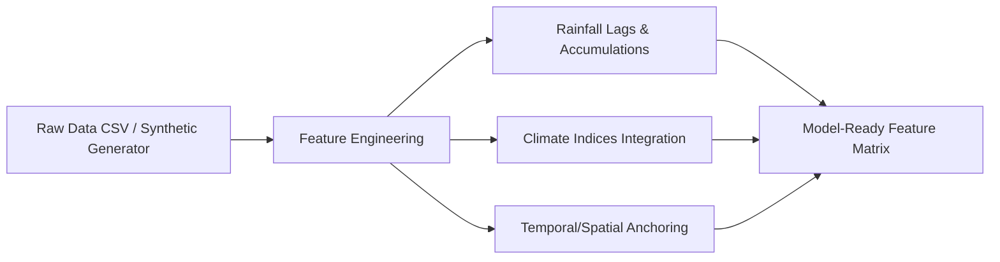
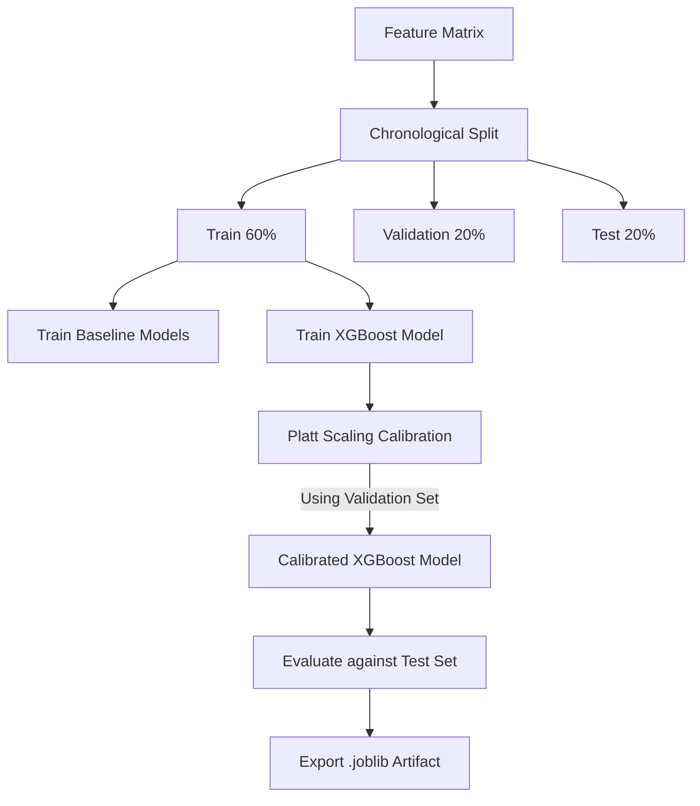

# Data, Risk Engine, and ML Pipeline

## Overview
MonsoonGuard transitions traditional meteorological forecasts into actionable agricultural insights. The system evaluates a combination of rainfall history, spatial geography, and large-scale climate indices to calculate the probabilities of specific monsoon events.

> **CRITICAL DISCLAIMER:** 
> The current Machine Learning pipeline utilizes a **synthetic smoke-test dataset**. There is no labeled historical dataset currently integrated into the repository. All ML components, model artifacts, and evaluation metrics described below demonstrate the *architectural capability* of the pipeline. They **do not represent scientific predictions or real-world forecasting accuracy**.

## 1. Feature Engineering
The pipeline processes raw meteorological inputs into engineered features designed to capture monsoon dynamics.

**Rainfall Features:**
*   `rainfall_lag_1`, `rainfall_lag_3`, `rainfall_lag_7`, `rainfall_lag_14`: Historical daily rainfall lags.
*   `rainfall_7d_cum`, `rainfall_30d_cum`: Rolling accumulation windows.
*   `consecutive_dry_days`: Number of consecutive days with rainfall < 2.5mm.
*   `rainfall_anomaly`: Difference between current rainfall and the 30-day rolling mean.

**Climate Features:**
*   `nino34`: El Niño Southern Oscillation (ENSO) index.
*   `dmi`: Indian Ocean Dipole (IOD) index.
*   `mjo_phase` & `mjo_amplitude`: Madden-Julian Oscillation characteristics.

**Temporal & Spatial Features:**
*   `day_of_year`: Identifies seasonality.
*   `days_since_monsoon_reference`: Offset from traditional June 1st onset.
*   `latitude` & `longitude`: Hyperlocal geographical anchoring.

## 2. Prediction Targets & False-Onset Logic
The system predicts distinct, probabilistically modeled events:

1.  **Onset Probability:** Likelihood of the monsoon commencing.
2.  **Persistence Probability:** Likelihood of continued rainfall post-onset.
3.  **Dry Spell Risk (7-day / 14-day):** Probability of an extended dry period.
4.  **Heavy Rainfall Risk:** Probability of crop-damaging downpours.

### False-Onset Centralization
False-Onset detection is a derived, deterministic calculation residing solely within the backend Risk Engine. It flags a trap condition when:
`Onset Probability is HIGH` AND `Persistence Probability is LOW` AND `Dry Spell Risk is HIGH`.

## 3. ML Models & Pipeline Architecture
The pipeline establishes a baseline and advances to a calibrated Gradient Boosting implementation.

*   **Baseline Models:** Logistic Regression, Random Forest.
*   **MVP Model:** XGBoost.
*   **Data Splitting:** Strict chronological splitting (Train -> Validation -> Test) to prevent time-series data leakage.
*   **Probability Calibration:** Because raw XGBoost outputs are not true probabilities, the pipeline applies Platt Scaling (sigmoid calibration) using cross-validation to ensure the output probabilities strictly represent real-world event likelihoods before they enter the Risk Engine.

### Data Processing & Feature Engineering Flow

### Model Training & Calibration Pipeline

### Production Integration Flow

