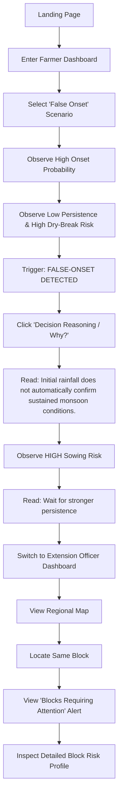
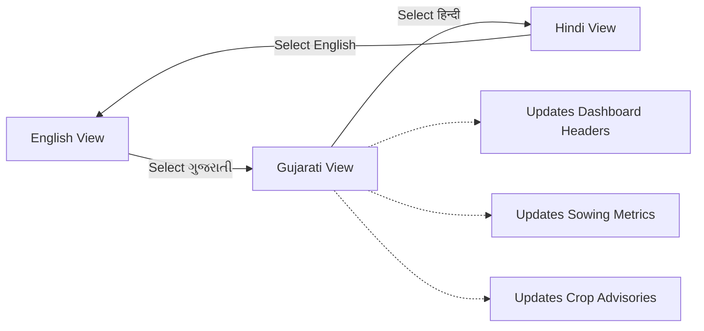
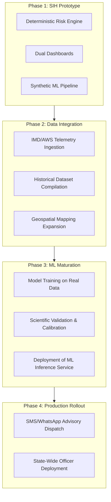

# Demo, Testing, and Roadmap

## 1. Demo Mode
To ensure flawless presentation during the SIH 2026 evaluation, the frontend application ships with a deterministic **Demo Mode**. This guarantees that judges can experience the full decision-support workflow without relying on live external meteorological APIs or complex local database seeding. 

The Demo Mode contains predefined scenarios that perfectly illustrate the core value proposition of MonsoonGuard: mitigating the risks associated with false onsets.

### The Three Core Scenarios
1.  **Persistent Onset:** High onset probability, high persistence, low dry-break risk. Safe for early sowing.
2.  **False Onset:** High onset probability, *low* persistence, *high* dry-break risk. High risk of crop failure if sown immediately.
3.  **Heavy Rain Risk:** High likelihood of immediate washout. Seed washout risk is critical.

---

## 2. Exact Judge Demonstration Flow

During the SIH evaluation, the recommended demonstration path is:

### Multilingual Demonstration
At any point during the Farmer Dashboard flow, the language dropdown in the navigation bar can be toggled to Gujarati or Hindi. 

---

## 3. Testing & Build Status
The prototype includes automated test suites to validate logic and integration.

*   **Frontend Build:** `PASS` (React/Vite transpilation and build successful).
*   **Backend Pytest Suite:** `7 PASSED`, `2 SKIPPED`. 
    *   *Note: Skipped tests require a live PostgreSQL/Docker instance which is bypassed in standard CI smoke testing.*

---

## 4. Known Limitations & Production Gaps
*   **ML Pipeline Data:** The current ML pipeline operates on synthetic data. Real-world probability forecasting requires integration with IMD/AWS historical datasets.
*   **Database Infrastructure:** In production, the SQLite fallback must be entirely replaced by a highly available PostgreSQL cluster (e.g., Google Cloud SQL).
*   **Live Weather Integration:** The `rule_based` and `demo` modes are hardcoded. A live CRON job fetching IMD/OpenWeatherMap telemetry is required for production.

---

## 5. Production Roadmap

